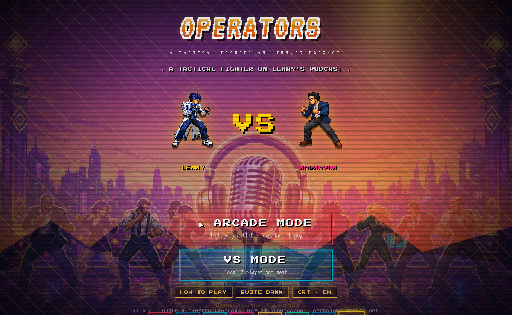
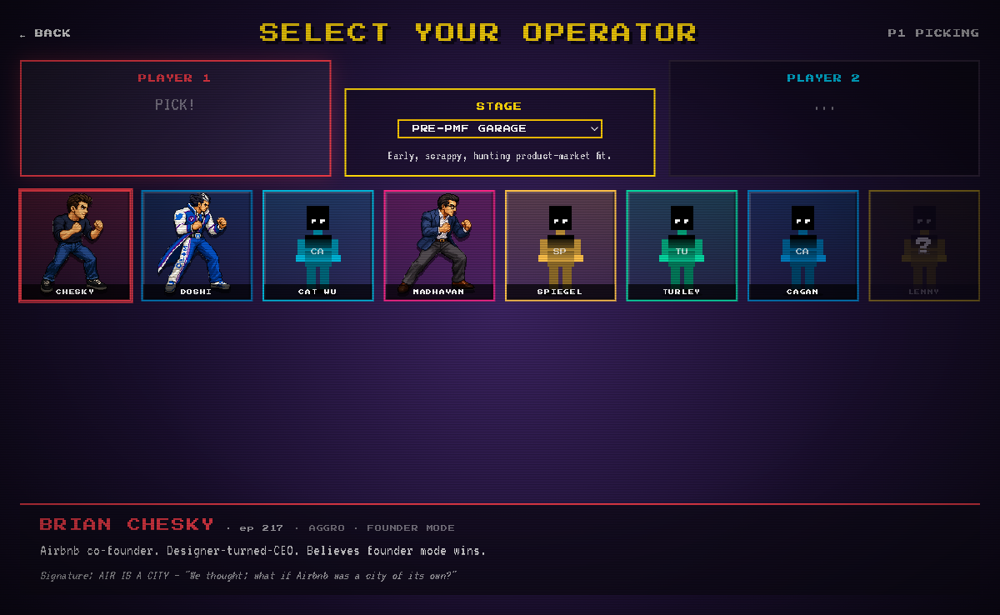
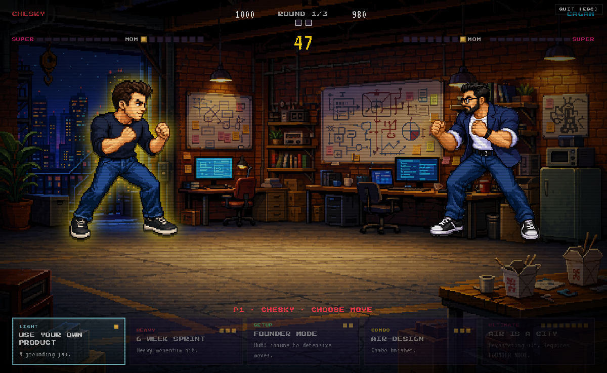
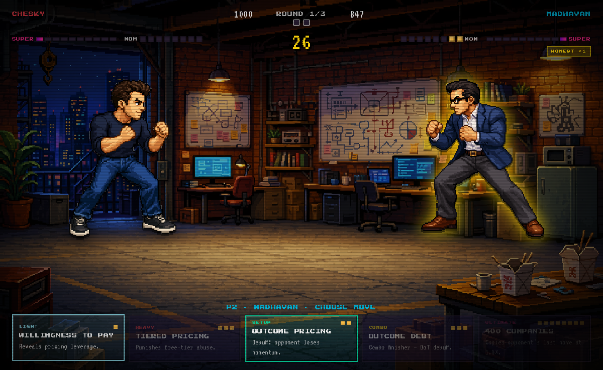

# OPERATORS

A turn-based tactical fighting game where 8 of the most iconic guests from **Lenny's Podcast** face off in 2D combat. Every fighter has 5 signature moves named after their real frameworks. Every move's flavor text is a verbatim quote with episode + timestamp. Every fight takes place in a business **scenario** — and each fighter does bonus damage in the scenarios where their philosophy actually applies.

Submission for the **[Lenny × Replit Buildathon](https://lennysbuildathon.replit.app/)** (May 6 – May 27, 2026).






## Stack

- **Vite + React 19 + TypeScript** — UI
- **Tailwind CSS v4** — styling, custom 24-color palette
- **Framer Motion** — combat juice (screen shake, banner slide-ins, transitions)
- **Zustand** — game state machine
- **WebAudio (procedural)** — chiptune SFX AND music synthesized at runtime (no audio assets shipped)
- **Replit Deployments** — hosting (required by buildathon)
- **Azure OpenAI gpt-image-2** — sprite generation pipeline (with edit-from-stance for character consistency)
- **Anthropic Claude** — fighter content extraction from podcast transcripts

## What's in the box

- **27 fighters** with full 5-move kits — every move is a real framework, every flavor quote is verbatim with episode + timestamp
- **8 stages** with topical descriptions + per-fighter scenario bonuses (Chesky +50% in Pre-PMF, Madhavan +50% in Pricing, etc.)
- **5 game modes**: Arcade · VS · Practice (infinite resources + AI dummy) · Daily Challenge (date-seeded matchup) · plus the boss fight against Lenny himself
- **3 difficulty levels** — easy/normal/hard scales bot AI weight functions
- **AI personalities** — every fighter's bot plays like the operator's philosophy (Chesky aggressive, Doshi sets up combos defensively, Jason Fried patient, etc.)
- **Combat juice**: K.O. cinematic with slow-mo flash + particle burst, hit-lag, full-screen combo banners, screen shake, damage floats, sprite attack-pose swap with lunge animation
- **Quote Bank**: search + 10 theme filters (pricing/distribution/AI-native/...) + Markdown export with YouTube deep-links
- **Framework Encyclopedia**: all 135 moves indexed by topic, clickable to open the real podcast at the real timestamp
- **CRT + procedural chiptune music + SFX** — togglable from menu

## Local dev

```bash
npm install
npm run dev
# open http://localhost:5173
```

## Deploy to Replit (buildathon submission)

The repo is fully self-contained — sprites and stages are committed under `public/`, so the build doesn't need any secrets to ship.

1. Go to https://replit.com → **Create Repl** → **Import from GitHub** → paste `https://github.com/andrey-esipov/operators`
2. Replit auto-detects the `.replit` config and runs `npm install && npm run build`
3. Click **Deploy** in the top-right → **Static deployment** → choose a name (e.g. `operators`)
4. Live at `<your-repl-name>.replit.app` (~30s build time)
5. (Optional) Regenerate sprites with your own Azure gpt-image-2: add these Replit Secrets, then run `npx tsx scripts/generate-fighter-sprites.ts --force`
   - `AZURE_OPENAI_ENDPOINT` — `https://<resource>.openai.azure.com`
   - `AZURE_OPENAI_API_KEY` — your key
   - `AZURE_OPENAI_DEPLOYMENT` — `gpt-image-2`

## Build

```bash
npm run build
```

## Asset generation

```bash
# Extract per-fighter content from the podcast/newsletter dataset
npx tsx scripts/extract-fighter-content.ts

# Generate fighter sprites via Azure gpt-image-2
npx tsx scripts/generate-fighter-sprites.ts
```

Required env vars (see `.env.example`):

```
ANTHROPIC_API_KEY=...
AZURE_OPENAI_API_KEY=...
AZURE_OPENAI_ENDPOINT=https://<resource>.openai.azure.com
AZURE_OPENAI_DEPLOYMENT=gpt-image-2
AZURE_OPENAI_API_VERSION=2025-04-01-preview
```

## Game design (one-pager)

- **Turn-based**, alternating moves, ~5-minute matches. Best of 3 rounds, 90s per round.
- **Resources**: HP (1000) · Momentum (1–8, +1/turn) · Super Meter (0–100)
- **Each fighter has 5 moves**: light · heavy · setup · combo · ultimate
- **Status effects** named after operator wisdom: CONFUSED ICP, FOUNDER MODE, OUTCOME DEBT, …
- **Combos** chain setup → finisher with a banner flash of the operator's iconic story
- **Reads** counter specific move types — adds prediction depth
- **Scenario-aware damage**: Chesky +50% in Pre-PMF; Madhavan +50% in Monetization; …
- **Ultimates**: 8 momentum + 100 super meter, character-defining signature moves

## Credits

- Podcast + newsletter data: [Lenny's Newsletter](https://www.lennysnewsletter.com/)
- Built with [Replit Agent](https://replit.com/agent)
- Inspired by Street Fighter II, King of Fighters, Slay the Spire, and [LennyRPG](https://www.lennysnewsletter.com/p/how-i-built-lennyrpg) by Ben Shih

## Status

May 13, 2026 — **14 fighters** with full move kits + verbatim quote pools, 8 stages, full combat loop, Arcade Mode + VS Mode + Quote Bank + How to Play screen, bespoke SF II title artwork. Building in public on X with #lennysbuildathon.

| Fighter | Episode | Archetype |
|---|---|---|
| Brian Chesky | ep 217 | AGGRO · Founder Mode |
| Shreyas Doshi | ep 142 | STRATEGY · Lock |
| Cat Wu | ep 304 | TEMPO · Ship Small |
| Madhavan Ramanujam | ep 273 | CONTROL · Pricing |
| Evan Spiegel | ep 308 | TANK · Distribution |
| Nick Turley | ep 287 | GLASS · Hypergrowth |
| Marty Cagan | ep 89 | CONTROL · Discovery |
| **Sam Altman** | ep 245 | GLASS · Scale |
| **Bret Taylor** | ep 271 | POLYMATH · Adaptive |
| **Lazar Jovanovic** | ep 287 | CHAOS · AI-Native |
| **Amjad Masad** | ep 263 | BUILDER · Platform |
| **Gokul Rajaram** | ep 192 | ORG · Hiring |
| **April Dunford** | ep 156 | POSITIONING · Sniper |
| Lenny Rachitsky ★ (boss) | ep 1–298 | BOSS · Pattern Match |

| Stage | Theme |
|---|---|
| Pre-PMF Garage | Early scrappy startup |
| Hypergrowth Office | Scaling, chart wall |
| The Plateau | Empty boardroom at sunset |
| The Datacenter | AI-native, GPU racks |
| The Cap Table | Executive negotiation |
| The Layoff | Crisis, packed boxes |
| Conference Stage | IPO prep, TED-talk audience |
| Hollywood Sign | Distribution destiny |
